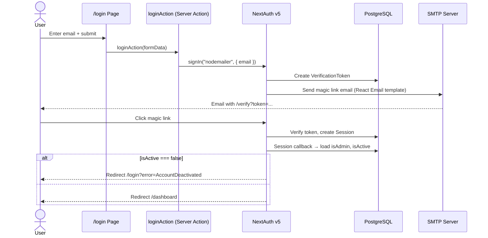
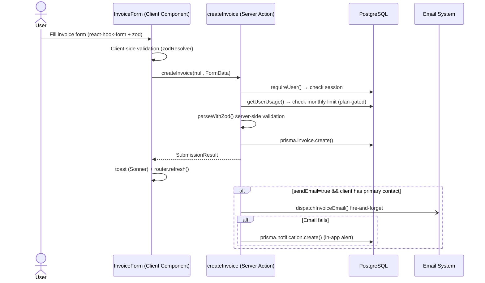
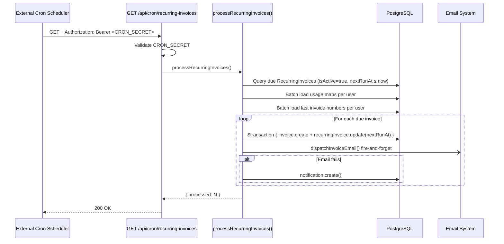
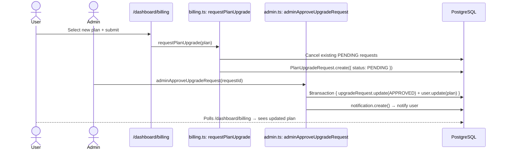
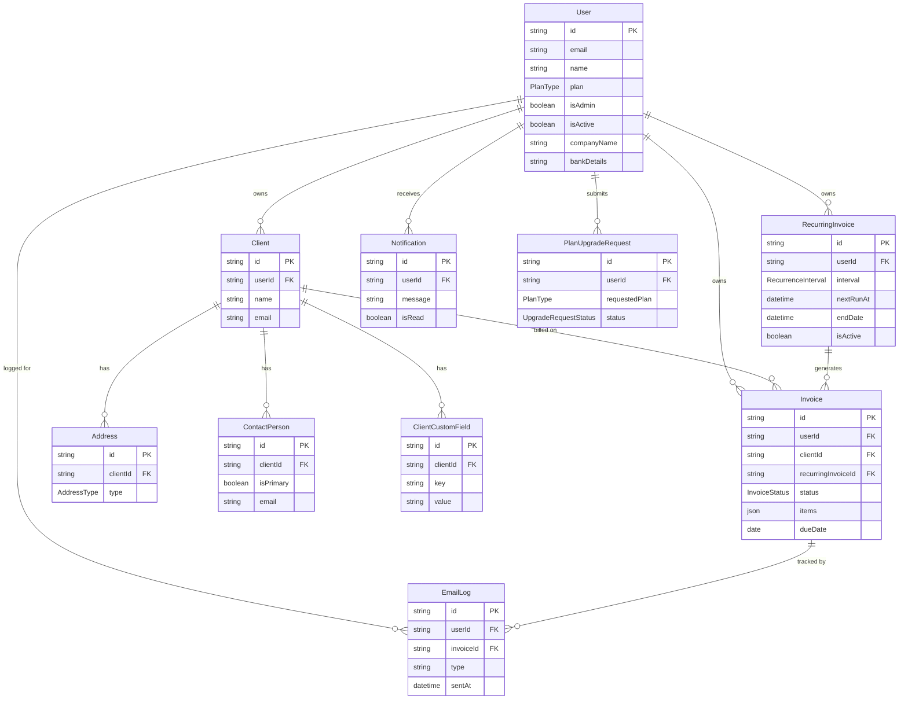

# System Architecture — invoice-wemaad

> Generated from codebase analysis. All paths reference `app/`, `lib/`, `prisma/`, and `components/`.

---

## 1. High-Level System Overview

```mermaid
flowchart TB
    Browser(["🌐 Browser / Client"])

    subgraph Vercel["☁️ Vercel Platform"]
        direction TB

        subgraph PublicPages["Public Pages (No Auth)"]
            PG_Land["/ — Landing"]
            PG_Login["/login — Magic Link Login"]
            PG_Verify["/verify — Link Confirmed"]
            PG_AuthErr["/auth/error — Auth Error"]
        end

        subgraph Auth["🔐 Authentication  (NextAuth v5 + Nodemailer)"]
            NA["next-auth\n/api/auth/*"]
            SA_Login["loginAction()\napp/login/actions.ts"]
        end

        subgraph DashLayout["Dashboard Layout  /dashboard/*  (requireUser)"]
            direction TB
            subgraph DashPages["Dashboard Pages"]
                PG_Home["/dashboard — Home (ISR 60s)"]
                PG_Inv["/dashboard/invoices — Invoice List"]
                PG_InvDel["/dashboard/invoices/:id/delete"]
                PG_InvPaid["/dashboard/invoices/:id/paid"]
                PG_Cli["/dashboard/clients — Client Table"]
                PG_CliDet["/dashboard/clients/:id"]
                PG_CliDel["/dashboard/clients/:id/delete"]
                PG_Rec["/dashboard/recurring-invoices"]
                PG_Rep["/dashboard/reports — Analytics (plan-gated)"]
                PG_Bil["/dashboard/billing — Plan Management"]
                PG_Prof["/dashboard/profile"]
            end
            UserCtx["UserProvider\n(React Context)"]
        end

        subgraph OnboardPages["Onboarding  (Post-Signup)"]
            PG_Onboard["/onboarding — Profile Setup"]
        end

        subgraph AdminLayout["Admin Layout  /admin/*  (requireAdmin)"]
            PG_AdminU["/admin/users"]
            PG_AdminUD["/admin/users/:id"]
        end

        subgraph ServerActions["⚡ Server Actions  (use server)"]
            direction LR
            SA_Inv["invoices.ts\ncreateInvoice\neditInvoice\ndeleteInvoice\nsendReminderEmail\nmarkAsPaid"]
            SA_Cli["clients.ts\ncreateClient\neditClient\ndeleteClient"]
            SA_Rec["recurringInvoices.ts\ncreateRecurringInvoice\ntoggleRecurringInvoice\ndeleteRecurringInvoice\nprocessRecurringInvoices"]
            SA_Admin["admin.ts\nadminGetAllUsers\nadminUpdateUserPlan\nadminApprove/RejectUpgrade\nadminToggleActive/Admin\nadminDeleteUser"]
            SA_Bil["billing.ts\nrequestPlanUpgrade\ngetUserPendingUpgrade"]
            SA_Notif["notifications.ts\ngetUserNotifications\nmarkAllNotificationsRead"]
            SA_Onb["onboarding.ts\nonboardUser"]
            SA_Prof["profile.ts\nupdateProfile"]
            SA_Cont["contact.ts\nsubmitContactForm"]
            SA_PDF["generate-invoice.tsx\ngenerateInvoicePDF"]
        end

        subgraph APIRoutes["🔌 API Route Handlers"]
            API_Auth["/api/auth/*\nNextAuth handler"]
            API_Cron["/api/cron/recurring-invoices\nBearer &lt;CRON_SECRET&gt;"]
            API_Chart["/api/dashboard/chart-data\nSession auth · range & status params"]
            API_InvPDF["/api/invoice/:id\nPublic PDF (HMAC-signed URL)"]
            API_Export["/api/reports/export\nCSV stream · Session auth"]
        end

        subgraph SessionGuard["Session Guard  lib/session.ts"]
            requireUser["requireUser()\n→ redirect /login if inactive"]
            requireAdmin["requireAdmin()\n→ redirect /dashboard if not admin"]
            requireOwner["requireInvoiceOwnership()"]
        end
    end

    subgraph DB["🗄️ PostgreSQL (Neon)  via Prisma 6"]
        direction TB
        T_User["User\n─────\nprofile · company · bank\nplan · isAdmin · isActive"]
        T_Invoice["Invoice\n─────\nstatus: PENDING|PAID\nitems (JSON)\nrecurringInvoiceId?"]
        T_Client["Client\n─────\naddresses · contactPersons\ncustomFields"]
        T_Rec["RecurringInvoice\n─────\ninterval: MONTHLY|QUARTERLY|YEARLY\nnextRunAt · endDate · isActive"]
        T_Notif["Notification\n─────\nin-app alerts\nisRead"]
        T_PUR["PlanUpgradeRequest\n─────\nstatus: PENDING|APPROVED|REJECTED"]
        T_ELog["EmailLog\n─────\naudit trail of all emails"]
        T_Auth["Account · Session\nVerificationToken\n(NextAuth tables)"]
    end

    subgraph Email["📧 Email System  (Nodemailer SMTP)"]
        SMTP["SMTP Server\n(EMAIL_SERVER_* env)"]
        subgraph Templates["React Email Templates"]
            ET_Welcome["welcomeEmail.tsx\n(magic link)"]
            ET_NewInv["newInvoice.tsx"]
            ET_UpdInv["updatedInvoice.tsx"]
            ET_Remind["reminderInvoice.tsx"]
            ET_Contact["contactForm.tsx\n→ abdullah@wemaad.net"]
        end
    end

    subgraph External["🌍 External Services"]
        CronSched["External Cron Scheduler\n(Vercel Cron / GitHub Actions / etc.)"]
        PDFLib["@react-pdf/renderer\n(server-side)"]
        HMAC["HMAC-signed URLs\ncrypto.createHmac(sha256, AUTH_SECRET)"]
    end

    %% User → Pages
    Browser -->|"HTTP requests"| PublicPages
    Browser -->|"Authenticated"| DashLayout
    Browser -->|"Admin only"| AdminLayout
    Browser -->|"Post-signup"| OnboardPages

    %% Pages → Auth
    PG_Login --> SA_Login
    SA_Login -->|"signIn('nodemailer')"| NA
    NA -->|"send magic link"| SMTP

    %% Auth → DB
    NA <-->|"sessions · tokens · accounts"| T_Auth

    %% Session guards
    DashLayout --> requireUser
    AdminLayout --> requireAdmin
    requireUser --> T_User
    requireAdmin --> T_User

    %% Pages → Server Actions (mutations)
    DashPages -->|"form submits"| SA_Inv
    DashPages -->|"form submits"| SA_Cli
    DashPages -->|"form submits"| SA_Rec
    DashPages -->|"form submits"| SA_Bil
    DashPages -->|"form submits"| SA_Prof
    DashPages -->|"form submits"| SA_Notif
    AdminLayout -->|"admin actions"| SA_Admin
    PG_Onboard -->|"submit"| SA_Onb
    PublicPages -->|"contact form"| SA_Cont

    %% Server Actions → DB
    SA_Inv <-->|"CRUD"| T_Invoice
    SA_Inv -->|"on failure"| T_Notif
    SA_Cli <-->|"CRUD"| T_Client
    SA_Rec <-->|"CRUD"| T_Rec
    SA_Rec -->|"creates"| T_Invoice
    SA_Admin <-->|"CRUD"| T_User
    SA_Admin <-->|"approve/reject"| T_PUR
    SA_Admin -->|"creates"| T_Notif
    SA_Bil -->|"creates"| T_PUR
    SA_Onb -->|"update"| T_User
    SA_Prof -->|"update"| T_User
    SA_Notif <-->|"read/mark"| T_Notif

    %% Server Actions → Email (fire-and-forget)
    SA_Inv -.->|"fire & forget\n(failure → Notification)"| SMTP
    SA_Rec -.->|"fire & forget"| SMTP
    SA_Cont -.->|"contact alert"| SMTP

    %% API Routes
    Browser -->|"chart data fetch"| API_Chart
    Browser -->|"public PDF link"| API_InvPDF
    Browser -->|"CSV export"| API_Export
    CronSched -->|"GET + Bearer token"| API_Cron
    API_Cron -->|"calls"| SA_Rec
    API_Chart -->|"query"| T_Invoice
    API_InvPDF -->|"HMAC verify"| HMAC
    API_InvPDF -->|"render"| SA_PDF
    SA_PDF -->|"render"| PDFLib

    %% Email templates
    SMTP --> Templates
    NA --> ET_Welcome

    %% DB relations
    T_User -->|"owns"| T_Invoice
    T_User -->|"owns"| T_Client
    T_User -->|"owns"| T_Rec
    T_User -->|"receives"| T_Notif
    T_User -->|"submits"| T_PUR
    T_Invoice -->|"linked to"| T_Client
    T_Invoice -->|"generated from"| T_Rec
    SA_Inv -->|"logs"| T_ELog
    SA_Rec -->|"logs"| T_ELog

    %% Styling
    classDef page fill:#dbeafe,stroke:#3b82f6,color:#1e3a5f
    classDef action fill:#dcfce7,stroke:#16a34a,color:#14532d
    classDef api fill:#fef9c3,stroke:#ca8a04,color:#713f12
    classDef db fill:#f3e8ff,stroke:#9333ea,color:#3b0764
    classDef email fill:#ffedd5,stroke:#ea580c,color:#7c2d12
    classDef ext fill:#f1f5f9,stroke:#64748b,color:#1e293b
    classDef auth fill:#fce7f3,stroke:#db2777,color:#831843

    class PG_Land,PG_Login,PG_Verify,PG_AuthErr,PG_Home,PG_Inv,PG_InvDel,PG_InvPaid,PG_Cli,PG_CliDet,PG_CliDel,PG_Rec,PG_Rep,PG_Bil,PG_Prof,PG_Onboard,PG_AdminU,PG_AdminUD page
    class SA_Inv,SA_Cli,SA_Rec,SA_Admin,SA_Bil,SA_Notif,SA_Onb,SA_Prof,SA_Cont,SA_PDF,SA_Login action
    class API_Auth,API_Cron,API_Chart,API_InvPDF,API_Export api
    class T_User,T_Invoice,T_Client,T_Rec,T_Notif,T_PUR,T_ELog,T_Auth db
    class SMTP,ET_Welcome,ET_NewInv,ET_UpdInv,ET_Remind,ET_Contact email
    class CronSched,PDFLib,HMAC ext
    class NA,requireUser,requireAdmin,requireOwner auth
```

---

## 2. Auth Flow

---

## 3. Invoice Creation Flow

---

## 4. Recurring Invoice Cron Job

---

## 5. Plan Upgrade Flow

---

## 6. Data Model Relationships

---

## 7. Key Architectural Decisions

| Decision | Choice | Notes |
|---|---|---|
| **Framework** | Next.js 15 App Router | Server Components + Server Actions as primary pattern |
| **Mutations** | Server Actions (`"use server"`) | No tRPC/REST endpoints for mutations — all direct SA calls |
| **Auth** | NextAuth v5 + Magic Link | No passwords/OAuth; database sessions (not JWT) |
| **Database** | PostgreSQL via Prisma 6 | Neon-compatible; global singleton client |
| **State** | React Context + react-hook-form | No Zustand/Redux/React Query |
| **Email** | Nodemailer SMTP + React Email | Fire-and-forget from Server Actions; failure creates Notification |
| **PDF** | @react-pdf/renderer (server-side) | Rendered in Server Action, served via API route |
| **Billing** | Manual admin-approval | No Stripe/payment gateway; admin approves via admin panel |
| **Cron** | HTTP-triggered API route | `Bearer <CRON_SECRET>`; any scheduler can call it |
| **Public links** | HMAC-signed invoice URLs | `crypto.createHmac(sha256, AUTH_SECRET)` — unforgeable without secret |
| **Route protection** | Layout/page guards | No `middleware.ts`; `requireUser()` / `requireAdmin()` in layouts |
| **Caching** | `unstable_cache` + ISR | Dashboard page ISR 60s; `revalidatePath` on mutations |
